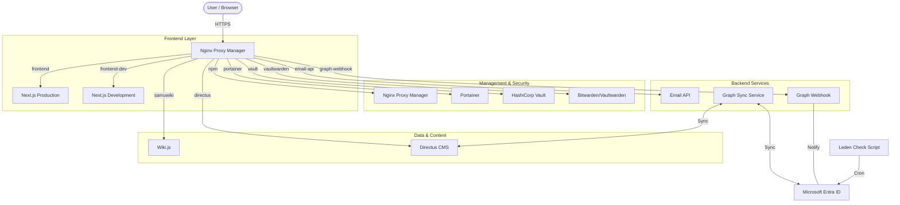

<p align="center">
<<<<<<< HEAD
  
</p>

# 🌐 SamuWebsiteV6

The modern, scalable website for Salve Mundi — built with Next.js, TypeScript, TailwindCSS, and real dev workflow standards.
=======
  
</p>

# 🌐 SaMuWebsiteV6

The central repository for Salve Mundi's digital infrastructure. This monorepo houses the modern website, synchronization services, and ecosystem configurations.
>>>>>>> Development

[](https://github.com/salvemundi/website/commits/main)
[](https://github.com/salvemundi/website/issues)
[](https://github.com/salvemundi/website/pulls)
<<<<<<< HEAD
[](https://github.com/salvemundi/website/blob/main/LICENSE)
=======

---

## 🏛️ Architecture & Infrastructure



### 📂 Project Structure

```text
/
├── .github/workflows/    # CI/CD Pipelines
├── directus/             # Headless MS Configuration
├── email-api/            # Email Sending Service
├── frontend/             # Next.js Frontend
│   ├── src/              # Source Code
│   └── public/           # Static Assets
├── graph-sync/           # Sync Service (Entra <-> Directus)
├── graph-webhook/        # Webhook Service (Entra Listener)
├── leden-check-script/   # PowerShell Automation
├── membership-api/       # Membership Logic
├── npm/                  # Nginx Proxy Manager Config
├── payment-api/          # Payment Processing
├── portainer/            # Portainer Config
├── samuwiki/             # Wiki.js Config
├── vaultwarden/          # Bitwarden Backup
└── README.md             # This file
```

---

## 🏗️ Services Overview

| Service | Path | Description |
|:---|:---|:---|
| **Website (Frontend)** | `/` | Next.js App Router (Production & Dev environments). |
| **Email API** | `/email-api` | Service for handling transactional emails. |
| **Directus** | `/directus` | Headless CMS for managing association data. |
| **Graph Sync** | `/graph-sync` | Bi-directional sync between Entra ID and Directus. |
| **Graph Webhook** | `/graph-webhook` | Event listener for real-time Entra ID changes. |
| **Nachtwacht** | `/leden-check-script` | PowerShell automation for member lifecycles. |
| **Infrastructure** | `/npm`, `/portainer`, `/samuwiki` | Docker configs for critical infra components. |
| **Security** | `(External)` | Vault and Vaultwarden (Managed via Portainer). |
>>>>>>> Development

---

## 🚀 Tech Stack

<<<<<<< HEAD
| Tool / Library               | Purpose                             |
|------------------------------|-------------------------------------|
| **Next.js (App Router)**     | Fullstack React framework           |
| **TypeScript**               | Static typing and clean code        |
| **Tailwind CSS**             | Utility-first styling               |
| **ESLint**                   | Code quality and formatting         |
| **Turbopack**                | Super-fast bundler for dev mode     |

✅ Uses default import alias: `@/*`  
✅ Based on real-world scalable development workflows
=======
| Domain | Technology |
|---|---|
| **Frontend** | Next.js 14, TypeScript, TailwindCSS, Framer Motion |
| **Backend / Sync** | Node.js, Express, Microsoft Graph API, Directus SDK |
| **Automation** | PowerShell Core, Docker, GitHub Actions |
| **Infrastructure** | Docker Compose, Nginx Proxy Manager, Postgres |

---

## 🔄 CI/CD & Deployment

This repository uses **GitHub Actions** for continuous delivery. Each service has its own independent workflow.

### 🔹 Deployment Strategy
*   **Development Branch**: Deploys automatically to the testing environment (typically tagged `:dev`).
*   **Main Branch**: Deploys to production (`:latest`).

### 🔹 Workflows
1.  **Backend Services**: Deployment pipelines for Graph Sync, Webhook, Email API.
2.  **Automation**: Scripts like Leden Check are deployed via cron/SSH.
3.  **Infrastructure**: Managed manually via Portainer or SSH for stability (Disaster Recovery configs in Git).
>>>>>>> Development

---

## 🛠️ Getting Started

<<<<<<< HEAD
**📖 See setup guide:**  
👉 [Setup Instructions](https://github.com/salvemundi/website/wiki/setup-instructions)

Basic steps:

```bash
git clone https://github.com/salvemundi/website.git
cd /website/samuwebsitev6
npm run dev
```

Then open: [http://localhost:3000](http://localhost:3000)
=======
### Prerequisites
*   Node.js 20+
*   Docker & Docker Compose
*   Git

### Local Development (Frontend)
```bash
git clone https://github.com/salvemundi/website.git
npm install
npm run dev
```

### Running Backend Services
Navigate to the specific service directory (e.g., `graph-sync`) and check its local `README.md` or `package.json` for start instructions. most services are Docker-first.
>>>>>>> Development

---

## 🧠 Contributing

We follow a consistent Way of Working across the team:

<<<<<<< HEAD
- Clear issue tracking
- Branch naming rules
- Commit message format
- Code in English, PascalCase naming, kebab-case branches

🔎 See: [Way of Working](https://github.com/salvemundi/website/wiki/way-of-working)

---

## 📚 Wiki Index

**Page & Description**  
⚙️ Setup Instructions: How to get the app running  
🛠️ Way of Working: Git workflow, commits, tasks, branches  
🧑‍💻 Contributors: Thanks to these awesome people

[](https://github.com/salvemundi/website/graphs/contributors)

Want to join the wall? Open a PR and contribute!

---

## 💬 Questions or Issues?

Found a bug? Open an issue.  
Want to improve the docs or code? Fork and submit a PR 🚀

---

## 📄 License

Licensed under SAMU??

---

> "Code is communication. Keep it clean."
=======
- **Clean Commits**: Use conventional commits (e.g., `feat: add sync logic`, `fix: style error`).
- **Branching**: `feature/my-feature` or `fix/my-bug`. Merge to `Development` first.
- **Language**: Code and Comments in English.

---

## 📚 Documentation & Links

*   **Setup Instructions**: [Wiki / Docs](https://github.com/salvemundi/website/wiki)
*   **Authentication**: [Entra ID Setup](readme/AUTH_SETUP.md)
*   **Email**: [Email Flow](readme/EMAIL_SETUP.md)

---

## 💬 Issues?

Found a bug or need a feature? Open an issue on GitHub.
Want to contribute? Fork the repo and open a Pull Request! 🚀

---

> "Code is communication. Keep it clean." - Salve Mundi Dev Team
>>>>>>> Development
