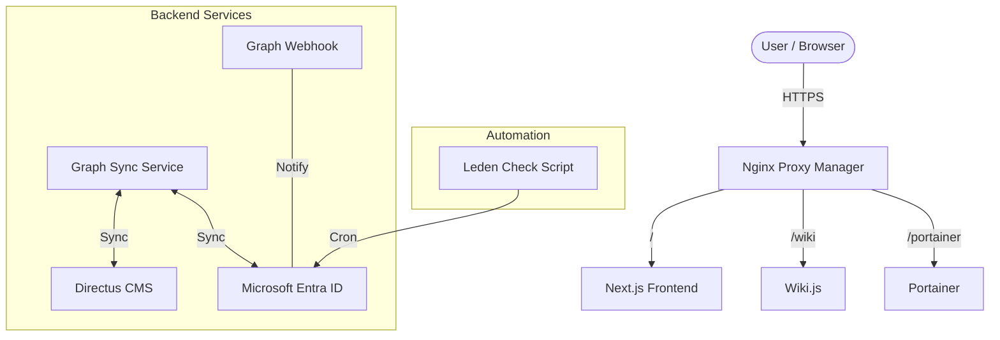

<p align="center">
  
</p>

# 🌐 SaMuWebsiteV6

The central repository for Salve Mundi's digital infrastructure. This monorepo houses the modern website, synchronization services, and ecosystem configurations.

[](https://github.com/salvemundi/website/commits/main)
[](https://github.com/salvemundi/website/issues)
[](https://github.com/salvemundi/website/pulls)

---

## �️ Architecture & Infrastructure



### 📂 Project Structure

```text
/
├── .github/workflows/    # CI/CD Pipelines
├── graph-sync/           # Node.js Sync Service
├── graph-webhook/        # Node.js Webhook Service
├── leden-check-script/   # PowerShell Automation
├── npm/                  # Nginx Proxy Manager Config
├── portainer/            # Portainer Config
├── samuwiki/             # Wiki.js Config
├── src/                  # Next.js Frontend Source
├── public/               # Static Assets
└── README.md             # This file
```

---

## �🏗️ Services Overview

| Service | Path | Type | Description |
|:---|:---|:---|:---|
| **Website (Frontend)** | `/` (Root) | Next.js | The main SaMuWebsiteV6 frontend using App Router & Server Actions. |
| **Graph Sync** | `/graph-sync` | Node.js | Bi-directional sync service between Microsoft Entra ID and Directus. |
| **Graph Webhook** | `/graph-webhook` | Node.js | Event listener for real-time Entra ID changes (Push Notifications). |
| **Nachtwacht** | `/leden-check-script` | PowerShell | Automation script for member lifecycle (Active vs Expired groups). |
| **Infrastructure** | `/npm`, `/portainer`, `/samuwiki` | Docker | Configuration backups for Nginx Proxy Manager, Portainer, and Wiki.js. |

---

## 🚀 Tech Stack

| Domain | Technology |
|---|---|
| **Frontend** | Next.js 14, TypeScript, TailwindCSS, Framer Motion |
| **Backend / Sync** | Node.js, Express, Microsoft Graph API, Directus SDK |
| **Automation** | PowerShell Core, Docker, GitHub Actions |
| **Infrastructure** | Docker Compose, Nginx Proxy Manager, Postgres |

---

## 🔄 CI/CD & Deployment

This repository uses **GitHub Actions** for continuous delivery. Each service has its own independent workflow.

### 🔹 Deployment Strategy
*   **Development Branch**: Deploys automatically to the testing environment (typically tagged `:dev`).
*   **Main Branch**: Deploys to production (`:latest`).

### 🔹 Workflows
1.  **Deploy Graph Sync**: Builds Docker image, pushes to GHCR, and redeploys via SSH.
2.  **Deploy Graph Webhook**: Builds Docker image, pushes to GHCR, and redeploys via SSH.
3.  **Leden Check Script**: Copies PowerShell script to the server (cronjob execution).
4.  **Disaster Recovery**: Infra configs (`npm`, `portainer`, `samuwiki`) are version controlled but managed manually on the server.

---

## 🛠️ Getting Started

### Prerequisites
*   Node.js 20+
*   Docker & Docker Compose
*   Git

### Local Development (Frontend)
```bash
git clone https://github.com/salvemundi/website.git
npm install
npm run dev
```

### Running Backend Services
Navigate to the specific service directory (e.g., `graph-sync`) and check its local `README.md` or `package.json` for start instructions. most services are Docker-first.

---

## 🧠 Contributing

We follow a consistent Way of Working across the team:

- **Clean Commits**: Use conventional commits (e.g., `feat: add sync logic`, `fix: style error`).
- **Branching**: `feature/my-feature` or `fix/my-bug`. Merge to `Development` first.
- **Language**: Code and Comments in English.

---

## 📚 Documentation & Links

*   **Setup Instructions**: [Wiki / Docs](https://github.com/salvemundi/website/wiki)
*   **Authentication**: [Entra ID Setup](readme/AUTH_SETUP.md)
*   **Email**: [Email Flow](readme/EMAIL_SETUP.md)

---

## 💬 Issues?

Found a bug or need a feature? Open an issue on GitHub.
Want to contribute? Fork the repo and open a Pull Request! 🚀

---

> "Code is communication. Keep it clean." - Salve Mundi Dev Team
