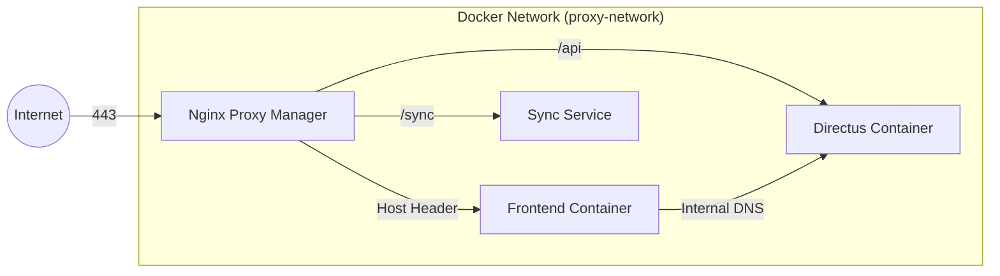
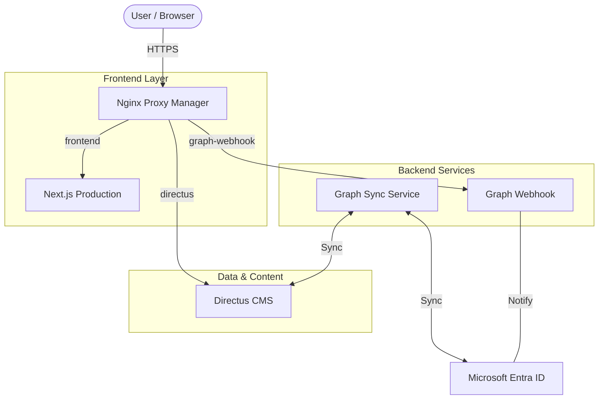

<p align="center">
  
</p>

# 🌐 SaMuWebsiteV6

The central repository for Salve Mundi's digital infrastructure. This monorepo houses the modern website, synchronization services, and ecosystem configurations.

[](https://github.com/salvemundi/website/commits/main)
[](https://github.com/salvemundi/website/issues)

---

## 🏛️ Architecture & Philosophy

This repository is built on two core architectural pillars: **Seamless Authentication** and **Single Source of Truth**.

### 1. Seamless Authentication (Zero Redirects)
We have eliminated the traditional "redirect to login" pattern. Users should never lose their context.

-   **AuthOverlay**: Instead of redirecting to `/login`, protected routes render an in-place overlay. The user stays on the URL they requested.
-   **Popup Login**: Logging in opens a Microsoft popup. The main window waits for the signal.
-   **Silent Refresh**: `AuthProvider` proactively refreshes tokens in the background to prevent session expiry disruptions.
-   **Granular Context**: Authentication state is split into `AuthUser` (data), `AuthStatus` (loading), and `AuthActions` (logic) to minimize React re-renders.

### 2. State-Driven Logic (Computed Status)
We avoid storing derived state in the database. Statuses are computed in real-time on the client or API.

-   **Example: Coupons**: A coupon does not have a "status" field in the DB.
    -   *Logic*: If `usage_count >= limit` → **Sold Out**. If `date < now` → **Expired**.
    -   This ensures the UI is always mathematically correct and never out of sync with the data.

### 3. PWA & Mobile First
We prioritize the mobile experience and application stability through a "Zero Redirect" policy.

-   **Viewport Locking**: Prevents accidental zooming on mobile inputs to ensure a native app-like feel.
-   **Standalone Stability**: Redirects can cause iOS PWAs to lose context or reset to the home screen. By using **AuthOverlay**, we accept the user exactly where they are, preserving their session and context.

---

## 🔄 CI/CD & DevOps

We use **GitHub Actions** for automated quality assurance and deployment.

### Pipelines
-   **Lint & Build Check**: Every Pull Request to `Development` or `main` triggers a full build validation. This blocks broken code from reaching production.
-   **Production Deploy (`main`)**: 
    1.  Builds optimized Docker image (`tag: latest`).
    2.  Pushes to **GitHub Container Registry (ghcr.io)**.
    3.  Connects to the production server via SSH.
    4.  Updates the running container via `docker-compose up -d --force-recreate`.
-   **Stage/Dev Deploy (`Development`)**: Similar flow, but targets the staging environment (`tag: dev`) and deploys to `dev.salvemundi.nl`.

### Infrastructure
The application operates as a containerized ecosystem orchestrated by **Docker Compose**.



-   **Orchestration**: Services (Frontend, API, Sync) communicate via a dedicated bridge network (`proxy-network`).
-   **Reverse Proxy**: Nginx Proxy Manager handles SSL termination (Let's Encrypt) and routing based on hostname.
-   **Environment Management**: Secrets are injected at runtime via GitHub Secrets (CI) or `.env` files (Local).

---

## 🏗️ System Overview



### 📂 Project Structure

```text
/
├── frontend/             # Next.js 16 App Router (The Core)
│   ├── src/features/auth # Authentication Logic (MSAL + Directus)
│   ├── src/entities      # Domain Objects (Committees, Activities)
│   └── src/components    # Shared UI (Design System)
├── directus/             # Headless CMS Configuration
├── graph-sync/           # Bi-directional Entra <-> Directus Sync
├── graph-webhook/        # Real-time Entra ID Listener
├── payment-api/          # Mollie Payment Processing
└── notification-api/     # PWA Push Notifications
```

---

## 🚀 Tech Stack

| Domain       | Technology    | Version          |
| ------------ | ------------- | ---------------- |
| **Frontend** | Next.js       | 16 (Turbopack)   |
| **Styling**  | TailwindCSS   | v3.4             |
| **Auth**     | MSAL Browser  | v3 (Silent Flow) |
| **State**    | React Context | Granular Split   |
| **Backend**  | Node.js       | v20+             |
| **CMS**      | Directus      | Headless         |

---

## 🛠️ Getting Started

### Prerequisites
*   Node.js 20+
*   Docker & Docker Compose

### Local Development (Frontend)
```bash
cd frontend
npm install
npm run dev
```

### Build & Production
```bash
npm run build
# Output will be in .next/standalone
```

---

## 🧠 Contributing

We follow a **"Why over What"** documentation style.
-   **Don't** comment: `// Sets user to null`
-   **Do** comment: `// Clears user state to prevent automatic re-login loops logic`

### Standards
1.  **No Redirects**: Use `LoginRequiredModal` or `AuthOverlay`.
2.  **Computed State**: Don't add status fields to the DB if they can be calculated.
3.  **Strict Types**: No `any`. Use functionality-specific interfaces.

---

> "Code is communication. Keep it clean." - Salve Mundi Dev Team
